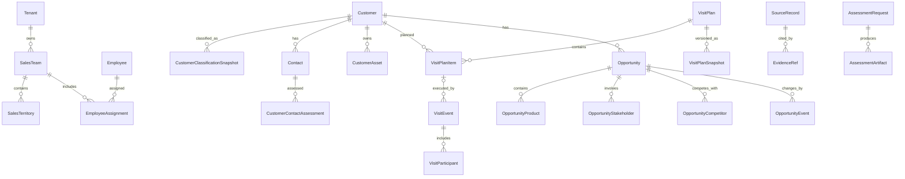

# DSM 统一行为数据模型 V1

> 模型编号：DSM-BEHAVIOR-DATA-MODEL  
> 版本：V1  
> 状态：confirmed_baseline  
> 确认日期：2026-08-07  
> 来源：评分智能体（SaaS基础数据表），26张工作簿、26个工作表、604个源字段

## 1. 结论

DSM 行为数据统一划分为七个业务域：

1. 组织、人员与时间；
2. 客户、联系人与现场信息；
3. 拜访计划、执行与日报；
4. 商机项目及变化；
5. 企业标准与版本化策略；
6. 派生指标与月度复盘；
7. 诊断、证据与数据质量。

统一模型采用四层结构：

```text
来源层 SourceRecord
→ 统一事实层 Canonical Facts
→ 派生指标层 MetricObservation
→ 评价结果层 Q40 Evaluation
```

月报、日报中的汇总数字和KPI得分不作为原始行为事实；存在拜访、客户、联系人或商机明细时，必须按锁定的计算版本从明细复算。周计划快照、客户分类、联系人关系和商机状态均作为带时间的不可变事实，不能只保存当前值。

自2026-08-07起，销售代表工作日报中的“当日项目会议总数”和“当日标书/建议书总数”正式停用，已从基础工作簿和源字段目录删除，不采集、不派生，也不进入Q40评分统计。

## 2. 建模原则

- 每个核心对象使用平台生成的稳定 `id`，外部编号作为来源业务键保留。
- 所有业务事实必须带 `tenant_id`；跨表关联优先使用编号，禁止只按姓名连接。
- 每条标准化记录保留 `source_system`、`source_table`、`source_record_id`、来源时间和内容哈希。
- 业务发生时间、来源记录时间、系统入库时间和有效期分别表达。
- 空值、业务零值、无记录和数据不足分别表达，不能统一改写为0。
- 企业标准以 `BehaviorPolicy` 版本化，必须有生效区间和状态。
- 宽表中的产品、决策链联系人和友商信息拆成子实体。
- 附件使用受控对象引用和内容哈希，文件名本身不是可靠证据。
- 派生指标保存计算窗口、计算版本和输入快照哈希。
- 正式评价结果保存数据、规则、汇总和模型版本，任何复算产生新结果。

## 3. 核心关系



## 4. 统一实体定义

### 4.1 组织、人员与时间

| 实体 | 粒度 | 关键业务键 | 主要来源 |
|---|---|---|---|
| Tenant | 一个DSM客户企业 | `tenant_id` | 销售代表结构、各标准表 |
| SalesTeam | 企业内一个销售团队 | `tenant_id + team_code` | 销售代表结构 |
| SalesTerritory | 一个销售区域或责任单元 | `tenant_id + territory_code` | 销售代表结构及业务表中的销售区域编码 |
| Employee | 一个自然人销售人员 | `tenant_id + employee_code` | 销售代表结构 |
| EmployeeAssignment | 人员一段有效期内的岗位关系 | `employee_id + valid_from` | 销售代表结构 |
| FiscalPeriod | 企业财年中的一个月度期间 | `tenant_id + month_code` | 公司财年月历 `A1:J73` |
| EmployeeAbsenceAdjustment | 人员某财月的扣除工作天数 | `employee_id + month_code + source_record_id` | 销售代表缺勤记录表 `A1:H3` |

`SalesTeam` 与 `SalesTerritory` 必须分开：源表同时出现销售团队编码、销售区域编号/编码，当前不能假定二者等价。

### 4.2 客户、联系人与现场信息

| 实体 | 粒度 | 关键业务键 | 主要来源 |
|---|---|---|---|
| Customer | 客户池中的一个客户组织 | `tenant_id + customer_code` | 客户信息表 `A1:AA6` |
| CustomerClassificationSnapshot | 客户在一个时间点的分类及整体关系 | `customer_id + effective_at` | 客户信息表 |
| Contact | 一个客户联系人 | `tenant_id + contact_code` | 客户联系人 `A1:V7` |
| CustomerContactAssessment | 联系人的决策角色、影响力和关系水平 | `contact_id + effective_at` | 客户联系人、商机决策链 |
| CustomerInformationCollectionEvent | 一次客户现场信息收集 | `tenant_id + source_record_id` | 客户现场信息收集表 `A1:L3` |
| CustomerAsset | 客户现场的一台设备 | `tenant_id + asset_code` | OA、会议、净水设备表 |
| AssetMetricObservation | 设备一次计数或性能观测 | `asset_id + metric_code + observed_at` | OA设备表中的读数和AMCV |

客户分类 I—IV 和客户整体关系水平属于会变化的判断，不直接覆盖 `Customer` 主记录。联系人影响力度兼容映射为：决策者→最终决策者、影响者→关键影响者、使用者→一般影响者、其他→无影响力者；同时保留源值。

### 4.3 拜访计划、执行与日报

| 实体 | 粒度 | 关键业务键 | 主要来源 |
|---|---|---|---|
| VisitPlan | 销售代表的一份周计划 | `tenant_id + plan_code` | 拜访计划制定表 `A1:N2` |
| VisitPlanItem | 周计划中的一次计划拜访 | `plan_id + customer_id + planned_date + source_record_id` | 拜访计划制定表 |
| VisitPlanSnapshot | 周计划在一个时间点的不可变版本 | `plan_id + snapshot_at` | 周计划快照 `A1:O2` |
| VisitEvent | 一次实际拜访或沟通 | `tenant_id + visit_record_code` | 拜访记录录入 `A1:AI7` |
| VisitParticipant | 人员/联系人参与一次拜访 | `visit_id + participant_type + participant_id` | 联系人信息、参加拜访人员 |
| DailyWorkReport | 代表一个工作日的一份日报 | `tenant_id + daily_report_code` | 销售代表工作日报 `A1:Q4` |

计划头和计划明细必须拆开：同一 `计划编码` 可对应多次计划拜访。快照表比计划表多出快照时间，统一模型不将其覆盖回当前计划。

### 4.4 商机项目及变化

| 实体 | 粒度 | 关键业务键 | 主要来源 |
|---|---|---|---|
| Opportunity | 一个持续存在的商机 | `tenant_id + opportunity_code` | 商机项目信息表 `A1:BX12` |
| OpportunityProduct | 商机中的一条产品明细 | `opportunity_id + line_number` | “商机项目产品”分组 |
| OpportunityStakeholder | 联系人在一个商机中的决策链角色 | `opportunity_id + contact_id + effective_at` | “采购决策”分组 |
| OpportunityCompetitor | 商机中的一个友商事实 | `opportunity_id + competitor_name + source_record_id` | “友商信息”分组 |
| OpportunityEvent | 商机新增、提前、推迟、取消、赢单或输单事件 | `opportunity_id + event_type + occurred_at + source_record_id` | 推迟及提前商机项目记录表 `A1:BX12` |

推迟/提前记录表是商机变化证据，不是第二份商机主表。其新旧商机编号、变化时间和原因应转换为事件，同时保留整行来源快照。

### 4.5 企业标准与版本化策略

以下源表统一进入 `BehaviorPolicy`，不各建一套无版本配置表：

| `policy_type` | 来源表 | 主要内容 |
|---|---|---|
| `visit_method_conversion` | 拜访方式-折算比例 | 各拜访方式折算比例 |
| `golden_time_window` | 拜访黄金时间标准 | 上午/下午黄金时间窗口 |
| `visit_purpose_by_customer_segment` | 拜访目的设置表 | 不同客户类型允许的拜访目的 |
| `customer_segment_definition_and_ratio` | 客户类型II定义及比例标准 | 潜力/目标/商机定义和结构标准 |
| `customer_information_collection_requirement` | 客户信息收集要求标准 | 指定收集表及是否强制 |
| `sales_rep_kpi` | 销售代表KPI评分标准 | 代表级活动与覆盖标准 |
| `sales_team_kpi` | 销售团队KPI评分标准 | 团队级活动与人员标准 |

所有策略均至少包含 `tenant_id`、`policy_version`、`effective_from`、`effective_to`、`status` 和 `configuration`。

### 4.6 派生指标、复盘与诊断

| 实体 | 粒度 | 主要来源 |
|---|---|---|
| MetricObservation | 主体在计算窗口内的一项版本化指标 | 个人/团队/公司活动月报及日报汇总 |
| MonthlyReview | 个人、团队或公司一个财月的复盘 | 三类月报中的总结与点评 |
| AssessmentRequest | 针对人员和时间窗口的一次诊断申请 | AI诊断申请表 `A1:P2` |
| AssessmentArtifact | 一份详细报告、40题报告或PDF | AI诊断申请表中的链接和文件字段 |
| SourceRecord | 一条外部记录的不可变来源版本 | 全部26张表 |
| EvidenceRef | 评价对来源记录/字段/附件的精确引用 | 评价运行生成 |
| DataQualityIssue | 一项数据质量问题及处理状态 | 导入、标准化和评价流程生成 |

## 5. 26张源表归属

| 来源表 | 来源角色 | 统一实体 |
|---|---|---|
| 销售代表结构 | 主数据 | Tenant、SalesTeam、SalesTerritory、Employee、EmployeeAssignment |
| 公司财年月历 | 参考数据 | FiscalPeriod |
| 销售代表缺勤记录表 | 事实 | EmployeeAbsenceAdjustment |
| 客户信息表 | 主数据+快照 | Customer、CustomerClassificationSnapshot |
| 客户联系人 | 主数据+快照 | Contact、CustomerContactAssessment |
| 客户现场信息收集表 | 事实 | CustomerInformationCollectionEvent、Attachment |
| 客户OA设备信息表 | 主数据+观测 | CustomerAsset、AssetMetricObservation |
| 会议设备信息表 | 主数据 | CustomerAsset |
| 客户净水设备信息表 | 主数据 | CustomerAsset |
| 拜访计划制定表 | 事实 | VisitPlan、VisitPlanItem |
| 拜访计划（周计划快照） | 不可变快照 | VisitPlanSnapshot |
| 拜访记录录入 | 事实 | VisitEvent、VisitParticipant、Attachment |
| 销售代表工作日报 | 报告+快照 | DailyWorkReport、MetricObservation |
| 商机项目信息表 | 主数据+快照 | Opportunity及三个子实体 |
| 推迟及提前商机项目记录表 | 不可变事件 | OpportunityEvent、SourceRecord |
| 7张企业标准表 | 策略 | BehaviorPolicy |
| 个人/团队/公司活动月报 | 派生快照 | MetricObservation、MonthlyReview |
| AI诊断申请表 | 工作流 | AssessmentRequest、AssessmentArtifact |

完整的逐字段来源目录见 [saas_source_field_catalog_v1.json](./saas_source_field_catalog_v1.json)。

## 6. 统一枚举

| 业务概念 | 源值 | 标准值 |
|---|---|---|
| 客户类型II | 潜力客户 / 目标客户 / 商机客户 | `potential` / `target` / `opportunity` |
| 联系人关系水平 | 零级—五级 | 0—5 |
| 联系人决策角色 | 决策者 / 影响者 / 使用者 / 其他 | `final_decision_maker` / `key_influencer` / `general_influencer` / `no_influence` |
| 拜访方式 | 面对面 / 视频 / 电话 / 微信邮件QQ | `face_to_face` / `video` / `phone` / `asynchronous_message` |
| 拜访自评 | 达到 / 部分达到 / 未达到目的 | `achieved` / `partially_achieved` / `not_achieved` |
| 商机结果 | 进行中 / 赢单 / 输单 / 取消 / 推迟 | `open` / `won` / `lost` / `cancelled` / `delayed` |

枚举映射必须同时保存源值、标准值和映射版本。

## 7. 强制数据质量规则

1. 不允许仅凭名称连接人员、团队、客户或联系人。
2. 客户编号、联系人编号、拜访记录编码、计划编码和商机项目编号必须保留。
3. 同一租户内设备编码重复时进入冲突队列，禁止自动覆盖。
4. 商机宽表续行只有在来源记录明确时才能继承父商机。
5. 月报汇总值与明细复算不一致时同时保存，并产生差异问题。
6. Excel日期序列统一转换为带时区日期/时间，同时保留原值。
7. 无记录、空值、零值、数据不足和不适用分别处理。
8. 任何Q40指标必须能回链到来源记录及字段。
9. 企业策略必须版本化；没有生效版本时不允许正式评分。
10. AI提取的候选事实必须经规则校验或人工确认后进入新快照。
11. 工作日报中已停用的“当日项目会议总数”和“当日标书/建议书总数”不得由连接器采集、由其他字段补算或用于Q40评分。
12. Q01综合拜访数量必须从《拜访记录录入》逐条重算：单条贡献=`1 ÷ 生效折算数量比例`；记录中的“折算比例”和“折算后的综合拜访数量”只用于对账，差异进入数据质量证据但不得覆盖重算值。
13. Q02时间区间优先采用“实际拜访开始时间＋实际拜访结束时间”；原始结束时间缺失时，采用“实际拜访开始时间＋拜访时长”补算。两种结束时间同时存在但不一致时使用原始结束时间，并记录`DQ-H01-02-END-DURATION-MISMATCH`。

## 8. 已识别的待确认项

| 编号 | 等级 | 问题 | 当前安全处理 |
|---|---|---|---|
| OQ-01 | 高 | 销售团队编码与销售区域编码是否存在历史混用 | 两个实体分开，保留原字段 |
| OQ-02 | 高 | 三类设备表“是否是尸体”的准确业务含义 | 仅保存原值，暂不映射为报废/无效 |
| OQ-03 | 高 | `KH` 与 `OA` 客户编号前缀是否同一编号空间 | 建立别名后再合并，不按前缀拆分 |
| OQ-04 | 高 | 样例存在设备编码跨客户重复 | 标记冲突，不自动覆盖 |
| OQ-05 | 中 | 联系人关系水平/影响力是否有独立变更日志 | 暂以导入时间作为最低有效时间 |
| OQ-06 | 中 | 历史月报指标口径是否发生过版本变化 | 原值保留并用明细复算对比 |
| OQ-07 | 中 | 正式商机阶段范围是P1-P5还是P1-P6 | 原值保留，规则层使用版本化阶段字典 |
| OQ-09 | 中 | 公司财年月历缺少公司标识，是否为全局共用 | 必须由连接器租户上下文补充归属 |

这些问题不阻止模型结构确认，但会阻止相关规则进入正式评分状态。

已解决：OQ-08于2026-08-07确认“折算数量比例”为除数。单条综合拜访数量=`1 ÷ 折算数量比例`；真实记录中比例7.5对应系统折算值0.13333333。系统已有比例和折算值只参与对账，评分使用按生效策略重算的结果。

## 9. Q40 接入顺序

1. 先导入组织、财年、企业策略和来源记录；
2. 再导入客户、联系人、分类及设备；
3. 导入计划、计划快照、拜访记录、日报；
4. 导入商机、产品、决策链、友商及变化事件；
5. 从明细计算覆盖率、拜访量、计划符合率和信息完整率；
6. 建立 Q01—Q40 指标到统一字段的显式映射；
7. 以黄金样例验证后，才将规则状态从 `pending` 切换为 `published`。

机器可读的实体、映射、枚举、质量规则和待确认项见 [dsm_behavior_data_model_v1.json](./dsm_behavior_data_model_v1.json)。
