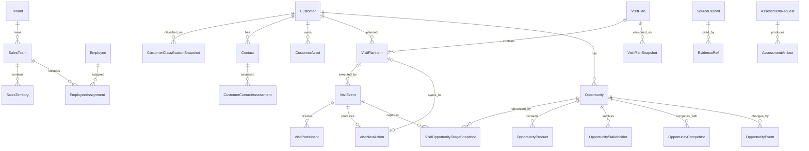

# DSM 统一行为数据模型 V1.5

> 模型编号：DSM-BEHAVIOR-DATA-MODEL  
> 版本：V1.5  
> 状态：confirmed_baseline  
> 确认日期：2026-08-10  
> 来源：评分智能体（SaaS基础数据表），27张工作簿、27个工作表、621个已归档源字段；另有已确认的运行时字段待随更新工作簿归档

## 1. 结论

DSM 行为数据统一划分为七个业务域：

1. 组织、人员与时间；
2. 客户、联系人与现场信息；
3. 拜访计划、执行与日报；
4. 商机项目及变化；
5. 企业标准与版本化策略；
6. 派生指标与月度复盘；
7. 诊断、证据与数据质量。

统一模型采用四层结构：

```text
来源层 SourceRecord
→ 统一事实层 Canonical Facts
→ 派生指标层 MetricObservation
→ 评价结果层 Q40 Evaluation
```

月报、日报中的汇总数字和KPI得分不作为原始行为事实；存在拜访、客户、联系人或商机明细时，必须按锁定的计算版本从明细复算。周计划快照、客户分类、联系人关系和商机状态均作为带时间的不可变事实，不能只保存当前值。

自2026-08-07起，销售代表工作日报中的“当日项目会议总数”和“当日标书/建议书总数”正式停用，已从基础工作簿和源字段目录删除，不采集、不派生，也不进入Q40评分统计。

V1.1以新版《拜访记录录入.xlsx》替换当前源表，范围由`A1:AI7`扩展为`A1:AM7`，新增关联商机项目名称、历史商机阶段、最新商机阶段和商机编号。四项信息统一保存为拜访发生时的商机阶段上下文，不能用后续最新阶段覆盖历史阶段。

V1.2以更正版《拜访记录录入.xlsx》替换源表，范围由`A1:AM7`扩展为`A1:AQ7`，新增`下一步行动目的`、`下一次具体其他目的`、`下次拜访期望的关键结果`和`下次联系客户时间安排`，并首次映射为`VisitNextAction`。V1.3在不改变这四个物理字段的基础上，修订了时间字段的回退规则。

V1.3确认客户下一步行动计划的来源优先级：默认读取拜访记录；目的和期望关键结果始终以拜访记录为准。只有`下次联系客户时间安排`为空时，才按`销售代表 + 客户编号`从拜访计划制定表选择严格晚于当前拜访日期的最早`计划拜访日期`作为时间回退值。解析后的目的、期望关键结果和时间均非空，即为一次完整的下次拜访计划，并以来源拜访记录编码为幂等键自动同步到拜访计划制定表。

V1.4新增逐日`WorkCalendarDay`与`EmployeeWorkdayAdjustment`。逐日基线参照国家法定工作日、法定节假日及调休工作日；外部日历只作为可插拔连接器输入，必须预先物化为带版本、来源引用和内容哈希的逐日快照；评分过程不得实时查询外部服务。2026-08-12确认Q36、Q37统一按`销售代表工作日报.日报日期`与法定工作日集合的差集推导缺勤：法定工作日无日报即缺勤并排除，不再依赖`销售代表缺勤记录表.缺勤日期`。

2026-08-14确认诊断周期采用双日期口径：诊断结束月份仍保存为所选月份最后一日并用于报告展示；结束月份为当前月时，实际评分截止日取首次来源快照在Asia/Shanghai时区的锁定日期，历史月份仍取月末。实际拜访、工作日报和逐日工作日统计只到实际评分截止日；评分截止前已提交的Q05/Q36/Q37未来计划继续保留。Q01、Q06排除当前未结束自然周，Q37允许按当前周已经发生的个人有效工作日评分。Q09自然日外推和Q24不完整月折算同步使用实际评分截止日。

V1.4同时确认：Q02活动数量分母仅包含面对面拜访和视频会议，任一合格记录同时缺少结束时间和拜访时长时整题数据不足；Q03本次拜访的`具体其他目的`直接映射`VisitEvent.other_purpose`；Q04允许一条拜访记录同时关联多条商机，并按商机编号拆成多条`VisitOpportunityStageSnapshot`。

2026-08-12更新Q29—Q35相关模型契约：正式商机阶段固定为P1—P5；Q32从商机项目信息表筛选结果=输单的数据，并以该条商机记录的系统创建时间作为默认输单时间，管理者介入证据必须发生在默认输单时间前；拜访及时性只使用不可变首次提交时间，24小时起点按结束时间、开始时间加时长、开始时间依次回退；Q35数量标准读取`公司标准日均拜访数量`，正常打卡比较打卡时间与实际拜访时间，日报具体安排字段可同时承载数量不足、打卡偏差和黄金时间不足说明。

同日确认的Q05新标准统一读取生效`VisitPlanSnapshot`：每日计划数量按实际工作日和公司日均标准判断；商机客户采用全计划硬门槛并检查目的逻辑；目标客户按月计算去重计划覆盖率；潜力客户同季度去重并按第1/2/3月40%/35%/25%节奏评价。旧的计划入表时间先后排序不再属于Q05。

2026-08-10确认Q18/Q36/Q37日期与计划方式口径：`拜访计划制定表`中的计划统一视为面对面拜访，可直接用于Q18计划接触和Q36次工作日计划，不再因该表没有计划方式字段标记数据不足；Q36以测评时日报的`日报日期`之后下一个个人有效工作日为目标日。2026-08-12进一步确认Q37复用Q36缺勤推导：国家法定工作日无该销售代表日报即缺勤并排除，不再等待缺勤记录表补齐日期字段。

2026-08-12确认Q16直接按销售代表读取`表外客户信息表`：存在记录即认定存在表外客户，`SourceRecord.source_created_at`固定取简道云系统提交时间并作为客户移出时间；提交时间落入测评期即认定为期间移出，不再要求与客户信息表互斥核验，也不再等待独立移出时间字段。

2026-08-12确认Q18总客户按`客户信息表.客户编号`去重并按`客户类型II`形成商机、目标和潜力分母；实际接触按`拜访记录录入.拜访日期`，计划接触按`拜访计划（周计划快照）.计划拜访日期`，两者均按客户编号去重。总取数边界为测评开始月第一日至测评结束月最后一日。

2026-08-12确认Q22三类数据锚点：具体分类只取`客户信息表.客户类型II`，分类标准只取`客户类型II（定义及比例标准）`，事实依据只取当前企业配置的客户信息收集表。三类来源不得互相覆盖；AI只判断标准是否清晰具体、事实是否支持当前分类，并必须回引信息收集记录ID。

同日补充Q01/Q08/Q11口径：Q01如果汇总活动占用时长，同一人同一日的重叠活动按时间区间并集计算，重叠部分只计一次，但Q01拜访数量仍按记录及生效折算比例计算；Q08目标客户数或潜力客户数任一为0时直接0分；Q11六项指标的“计划覆盖客户数”分母均是测评范围内`客户信息表`全部客户编号去重数。

V1.5按原文件名新增`销售人员行动计划表.xlsx`，九个字段直接映射`SalesImprovementActionPlan`。该实体是Q40的月度改善行动直接来源，不与`VisitPlanItem`或`VisitNextAction`混用：计划质量读取行动、期望结果、负责人和计划完成时间；执行结果读取实际完成时间和结果回顾；月度归属优先由计划完成时间映射公司财月。

## 2. 建模原则

- 每个核心对象使用平台生成的稳定 `id`，外部编号作为来源业务键保留。
- 所有业务事实必须带 `tenant_id`；跨表关联优先使用编号，禁止只按姓名连接。
- 每条标准化记录保留 `source_system`、`source_table`、`source_record_id`、来源时间和内容哈希。
- 业务发生时间、来源记录时间、系统入库时间和有效期分别表达。
- 空值、业务零值、无记录和数据不足分别表达，不能统一改写为0。
- 企业标准以 `BehaviorPolicy` 版本化，必须有生效区间和状态。
- 宽表中的产品、决策链联系人和友商信息拆成子实体。
- 附件使用受控对象引用和内容哈希，文件名本身不是可靠证据。
- 派生指标保存计算窗口、计算版本和输入快照哈希。
- 正式评价结果保存数据、规则、汇总和模型版本，任何复算产生新结果。

## 3. 核心关系



## 4. 统一实体定义

### 4.1 组织、人员与时间

| 实体 | 粒度 | 关键业务键 | 主要来源 |
|---|---|---|---|
| Tenant | 一个DSM客户企业 | `tenant_id` | 销售代表结构、各标准表 |
| SalesTeam | 企业内一个销售团队 | `tenant_id + team_code` | 销售代表结构 |
| SalesTerritory | 一个销售区域或责任单元 | `tenant_id + territory_code` | 销售代表结构及业务表中的销售区域编码 |
| Employee | 一个自然人销售人员 | `tenant_id + employee_code` | 销售代表结构 |
| EmployeeAssignment | 人员一段有效期内的岗位关系 | `employee_id + valid_from` | 销售代表结构 |
| FiscalPeriod | 企业财年中的一个月度期间 | `tenant_id + month_code` | 公司财年月历 `A1:J73` |
| WorkCalendarDay | 租户逐日工作日快照中的一个自然日 | `tenant_id + calendar_date + calendar_version` | 国家法定工作日、节假日与调休通知；批准的外部日历适配器 |
| EmployeeWorkdayAdjustment | 人员某自然日的工作日调整 | `employee_id + calendar_date + source_record_id` | 销售代表工作日报的`日报日期`与`WorkCalendarDay`差集；HR/考勤日历仅作扩展或对账 |
| EmployeeAbsenceAdjustment | 人员某财月的扣除工作天数对账记录 | `employee_id + month_code + source_record_id` | 销售代表缺勤记录表历史字段 `A1:H3` |

`SalesTeam` 与 `SalesTerritory` 必须分开：源表同时出现销售团队编码、销售区域编号/编码，当前不能假定二者等价。

### 4.2 客户、联系人与现场信息

| 实体 | 粒度 | 关键业务键 | 主要来源 |
|---|---|---|---|
| Customer | 客户池中的一个客户组织 | `tenant_id + customer_code` | 客户信息表 `A1:AA6` |
| CustomerClassificationSnapshot | 客户在一个时间点的分类及整体关系 | `customer_id + effective_at` | 客户信息表 |
| Contact | 一个客户联系人 | `tenant_id + contact_code` | 客户联系人 `A1:V7` |
| CustomerContactAssessment | 联系人的决策角色、影响力和关系水平 | `contact_id + effective_at` | 客户联系人、商机决策链 |
| CustomerInformationCollectionEvent | 一次客户现场信息收集 | `tenant_id + source_record_id` | 客户现场信息收集表 `A1:L3` |
| CustomerAsset | 客户现场的一台设备 | `tenant_id + asset_code` | OA、会议、净水设备表 |
| AssetMetricObservation | 设备一次计数或性能观测 | `asset_id + metric_code + observed_at` | OA设备表中的读数和AMCV |

客户分类 I—IV 和客户整体关系水平属于会变化的判断，不直接覆盖 `Customer` 主记录。联系人影响力度兼容映射为：决策者→最终决策者、影响者→关键影响者、使用者→一般影响者、其他→无影响力者；同时保留源值。

### 4.3 拜访计划、执行与日报

| 实体 | 粒度 | 关键业务键 | 主要来源 |
|---|---|---|---|
| VisitPlan | 销售代表的一份周计划 | `tenant_id + plan_code` | 拜访计划制定表 `A1:N2` |
| VisitPlanItem | 周计划中的一次计划拜访 | `plan_id + customer_id + planned_date + source_record_id` | 拜访计划制定表 |
| VisitPlanSnapshot | 周计划在一个时间点的不可变版本 | `plan_id + snapshot_at` | 周计划快照 `A1:O2` |
| VisitEvent | 一次实际拜访或沟通 | `tenant_id + visit_record_code` | 拜访记录录入；已归档范围`A1:AQ7`，新增`具体其他目的`字段待更新工作簿归档 |
| VisitNextAction | 一次拜访记录形成的一条下一行动安排 | `visit_event_id + source_record_id` | 拜访记录录入的下一行动四字段 |
| VisitOpportunityStageSnapshot | 一次拜访关联的商机阶段上下文 | `visit_event_id + opportunity_code + source_record_id` | 拜访记录录入的关联商机阶段信息 |
| VisitParticipant | 人员/联系人参与一次拜访 | `visit_id + participant_type + participant_id` | 联系人信息、参加拜访人员 |
| DailyWorkReport | 代表一个工作日的一份日报 | `tenant_id + daily_report_code` | 销售代表工作日报 `A1:Q4` |

计划头和计划明细必须拆开：同一 `计划编码` 可对应多次计划拜访。快照表比计划表多出快照时间，统一模型不将其覆盖回当前计划。拜访记录的首次提交时间保存为`VisitEvent.submitted_at`，必须来自业务系统日志或语义明确的源数据提交时间。

`VisitNextAction`的目的、其他目的和期望关键结果以同一条拜访记录编码归属。时间优先使用拜访记录；为空时才允许从计划表回退，并保存`next_contact_at_source`及`fallback_visit_plan_item_id`。完整计划同步时保存`sync_status`、`synced_visit_plan_item_id`和`synced_at`；若回退时间来自已有计划，则只建立关联，不重复创建计划。

本次拜访的`具体其他目的`与下一行动的`下一次具体其他目的`是两个不同字段：前者进入`VisitEvent.other_purpose`供Q03使用，后者进入`VisitNextAction.next_action_other_purpose`。同一拜访选择多个商机时，连接器按商机编号生成多条阶段快照，禁止只保留第一条。

Q12只允许从已映射结构化字段生成采购潜力、采购时间和友商信息候选事实；附件和上传文件不解析。三组结构化字段均为空时直接0分。

Q13按“销售代表×自然季度”生成信息收集覆盖指标。计划覆盖客户来自测评截止时`Customer`中归属销售代表的客户编号去重集合，与Q11分母定义一致；不再使用季度内`VisitEvent.customer_id`形成的实际覆盖客户。信息收集客户来自`CustomerInformationCollectionEvent.customer_id`去重集合。第二项从`VisitParticipant.participant_id`读取拜访记录中的联系人关联主键，按销售代表、客户和季度累计去重，至少两个不同联系人即为合格客户。考核期跨季度时逐季评分后取季度综合分平均。Q13-v1允许无个人过滤读取同团队全部当前在职人员数据，但团队明细仅用于进程内匿名聚合；报告和评分接口只输出被测人指标及团队平均，不输出其他成员姓名、记录编号或个人比例。

Q14周拜访活动数量只统计`VisitEvent.visit_method`为面对面拜访或视频会议的记录。Q18和Q19每个比例子项遇到零分母时，该子项得0分并保留原权重，不做权重重分配。

Q34-v4仅以测评周期内的面对面拜访为两项比例分母。AI完成五项检查后给出完全达成、部分达成或未达成结论，再与拜访记录评价比较。同客户最近上一访可跨测评周期；本次目的、上一访下一行动目的和本次下一行动全部只从拜访记录取得，不回退到拜访计划表。商机客户仍采用明确共识表述加同一拜访具体下一行动的双门槛；目标客户的下一拜访不得处于同月，潜力客户不得处于同季。否定表述优先排除，受控AI不直接计算最终分。

Q37-v2只读取周计划快照、公司标准日均拜访数量和销售代表有效工作日。周合格率固定以`公司标准日均拜访数量×4.5`为分母；目的项只判断`拜访目的`是否非空，目的为`其他`时`具体其他目的`也必须非空。Q37不再读取上一次拜访、商机阶段或AI语义事实。

### 4.4 商机项目及变化

| 实体 | 粒度 | 关键业务键 | 主要来源 |
|---|---|---|---|
| Opportunity | 一个持续存在的商机 | `tenant_id + opportunity_code` | 商机项目信息表 `A1:BX12` |
| OpportunityProduct | 商机中的一条产品明细 | `opportunity_id + line_number` | “商机项目产品”分组 |
| OpportunityStakeholder | 联系人在一个商机中的决策链角色 | `opportunity_id + contact_id + effective_at` | “采购决策”分组 |
| OpportunityCompetitor | 商机中的一个友商事实 | `opportunity_id + competitor_name + source_record_id` | “友商信息”分组 |
| OpportunityEvent | 商机新增、提前、推迟、取消、赢单或输单事件 | `opportunity_id + event_type + occurred_at + source_record_id` | 推迟及提前商机项目记录表 `A1:BX12` |

推迟/提前记录表是商机变化证据，不是第二份商机主表。其新旧商机编号、变化时间和原因应转换为事件，同时保留整行来源快照。

### 4.5 企业标准与版本化策略

以下源表统一进入 `BehaviorPolicy`，不各建一套无版本配置表：

| `policy_type` | 来源表 | 主要内容 |
|---|---|---|
| `visit_method_conversion` | 拜访方式-折算比例 | 各拜访方式折算比例 |
| `golden_time_window` | 拜访黄金时间标准 | 上午/下午黄金时间窗口 |
| `visit_purpose_by_customer_segment` | 拜访目的设置表 | 不同客户类型允许的拜访目的 |
| `customer_segment_definition_and_ratio` | 客户类型II定义及比例标准 | 潜力/目标/商机定义和结构标准 |
| `customer_information_collection_requirement` | 客户信息收集要求标准 | 指定收集表及是否强制 |
| `sales_rep_kpi` | 销售代表KPI评分标准 | 代表级活动与覆盖标准 |
| `sales_team_kpi` | 销售团队KPI评分标准 | 团队级活动与人员标准 |

所有策略均至少包含 `tenant_id`、`policy_version`、`effective_from`、`effective_to`、`status` 和 `configuration`。

### 4.6 派生指标、复盘与诊断

| 实体 | 粒度 | 主要来源 |
|---|---|---|
| MetricObservation | 主体在计算窗口内的一项版本化指标 | 个人/团队/公司活动月报及日报汇总 |
| MonthlyReview | 个人、团队或公司一个财月的复盘 | 三类月报中的总结与点评 |
| SalesImprovementActionPlan | 销售人员的一项月度改善行动 | 销售人员行动计划表 `A1:I2` |
| AssessmentRequest | 针对人员和时间窗口的一次诊断申请 | AI诊断申请表 `A1:P2` |
| AssessmentArtifact | 一份详细报告、40题报告或PDF | AI诊断申请表中的链接和文件字段 |
| SourceRecord | 一条外部记录的不可变来源版本 | 全部27张表 |
| EvidenceRef | 评价对来源记录/字段/附件的精确引用 | 评价运行生成 |
| DataQualityIssue | 一项数据质量问题及处理状态 | 导入、标准化和评价流程生成 |

## 5. 27张源表归属

| 来源表 | 来源角色 | 统一实体 |
|---|---|---|
| 销售代表结构 | 主数据 | Tenant、SalesTeam、SalesTerritory、Employee、EmployeeAssignment |
| 公司财年月历 | 参考数据 | FiscalPeriod |
| 销售代表缺勤记录表 | 事实 | EmployeeAbsenceAdjustment（月度对账，不参与Q01/Q36/Q37逐日缺勤推导） |
| 客户信息表 | 主数据+快照 | Customer、CustomerClassificationSnapshot |
| 客户联系人 | 主数据+快照 | Contact、CustomerContactAssessment |
| 客户现场信息收集表 | 事实 | CustomerInformationCollectionEvent、Attachment |
| 客户OA设备信息表 | 主数据+观测 | CustomerAsset、AssetMetricObservation |
| 会议设备信息表 | 主数据 | CustomerAsset |
| 客户净水设备信息表 | 主数据 | CustomerAsset |
| 拜访计划制定表 | 事实 | VisitPlan、VisitPlanItem |
| 销售人员行动计划表 | 事实/工作流 | SalesImprovementActionPlan |
| 拜访计划（周计划快照） | 不可变快照 | VisitPlanSnapshot |
| 拜访记录录入 | 事实+下一行动+商机阶段快照 | VisitEvent、VisitNextAction、VisitOpportunityStageSnapshot、VisitParticipant、Attachment |
| 销售代表工作日报 | 报告+快照 | DailyWorkReport、MetricObservation |
| 商机项目信息表 | 主数据+快照 | Opportunity及三个子实体 |
| 推迟及提前商机项目记录表 | 不可变事件 | OpportunityEvent、SourceRecord |
| 7张企业标准表 | 策略 | BehaviorPolicy |
| 个人/团队/公司活动月报 | 派生快照 | MetricObservation、MonthlyReview |
| AI诊断申请表 | 工作流 | AssessmentRequest、AssessmentArtifact |

完整的逐字段来源目录见 [saas_source_field_catalog_v1_3.json](./saas_source_field_catalog_v1_3.json)。

## 6. 统一枚举

| 业务概念 | 源值 | 标准值 |
|---|---|---|
| 客户类型II | 潜力客户 / 目标客户 / 商机客户 | `potential` / `target` / `opportunity` |
| 联系人关系水平 | 零级—五级 | 0—5 |
| 联系人决策角色 | 决策者 / 影响者 / 使用者 / 其他 | `final_decision_maker` / `key_influencer` / `general_influencer` / `no_influence` |
| 拜访方式 | 面对面 / 视频 / 电话 / 微信邮件QQ | `face_to_face` / `video` / `phone` / `asynchronous_message` |
| 拜访自评 | 达到 / 部分达到 / 未达到目的 | `achieved` / `partially_achieved` / `not_achieved` |
| 商机结果 | 进行中 / 赢单 / 输单 / 取消 / 推迟 | `open` / `won` / `lost` / `cancelled` / `delayed` |
| 商机阶段 | P1 / P2 / P3 / P4 / P5 | 可以获得参与 / 获得提方案的机会 / 许可参与商务谈判的机会 / 赢得客户的订单 / 完成合同 |

枚举映射必须同时保存源值、标准值和映射版本。

## 7. 强制数据质量规则

1. 不允许仅凭名称连接人员、团队、客户或联系人。
2. 客户编号、联系人编号、拜访记录编码、计划编码和商机项目编号必须保留。
3. 同一租户内设备编码重复时进入冲突队列，禁止自动覆盖。
4. 商机宽表续行只有在来源记录明确时才能继承父商机。
6. Excel日期序列统一转换为带时区日期/时间，同时保留原值。
7. 无记录、空值、零值、数据不足和不适用分别处理。
8. 任何Q40指标必须能回链到来源记录及字段。
9. 企业策略必须版本化；没有生效版本时不允许正式评分。
10. AI提取的候选事实必须经规则校验或人工确认后进入新快照。
11. 工作日报中已停用的“当日项目会议总数”和“当日标书/建议书总数”不得由连接器采集、由其他字段补算或用于Q40评分。
12. Q01综合拜访数量必须从《拜访记录录入》逐条重算：单条贡献=`1 ÷ 生效折算数量比例`；记录中的“折算比例”和“折算后的综合拜访数量”只用于对账，差异进入数据质量证据但不得覆盖重算值。
13. Q02时间区间优先采用“实际拜访开始时间＋实际拜访结束时间”；原始结束时间缺失时，采用“实际拜访开始时间＋拜访时长”补算。两种结束时间同时存在但不一致时使用原始结束时间，并记录`DQ-H01-02-END-DURATION-MISMATCH`。
13.1 Q02未配置适用于当前公司/团队的拜访黄金时间标准时，直接记E=0分并正常输出报告，不进入证据不足状态。
14. 拜访关联商机时，历史商机阶段与来源时点的最新商机阶段分别保存；商机编号为空时禁止仅按商机名称自动关联。
15. 拜访记录是下一行动默认来源；目的和期望关键结果禁止从计划表回填。只有时间为空时，才按销售代表、客户编号选择当前拜访日期之后最早的计划日期，并保存来源计划引用。
16. 完整计划按“目的、期望关键结果、解析后的时间均非空”判断。同步到拜访计划制定表必须使用租户与来源拜访记录编码形成幂等键；已有回退计划只关联，不重复新增。
17. Q01、Q36和Q37的有效工作日必须由逐日`WorkCalendarDay`确定，禁止把月度有效工作天数平均分摊到周或日。外部日历接入采用[RFC 5545 iCalendar](https://www.rfc-editor.org/info/rfc5545/)或等价API，法定节假日与调休基线引用国务院年度通知；人员缺勤按法定工作日与`销售代表工作日报.日报日期`差集逐日推导；所有输入先物化、版本化并保存哈希。
18. Q02活动数量分母只包含面对面拜访和视频会议；任一合格记录同时缺少结束时间和拜访时长时，整题判为数据不足。
19. Q03的`VisitEvent.other_purpose`直接读取本次拜访的`具体其他目的`；更新后的工作簿归档前，不补写源字段目录的物理列号和哈希。
20. 一条拜访记录可关联多条商机，必须按商机编号拆分为多条阶段快照；多值错位、编号缺失或重复时不得只取第一条。
21. 联系人关系水平、影响力度和关系位置的历史判断必须读取联系人表数据日志或版本化导出，并物化为带`valid_from/valid_to`的`CustomerContactAssessment`快照；只有当前值时不得倒推关系提升。
22. Q32从商机项目信息表筛选结果=输单的数据，以该条商机记录的系统创建时间作为默认输单时间；缺少系统创建时间时登记数据质量问题，禁止用记录更新时间、文件时间或数据接入时间代替。
23. Q33提交时间必须是后续编辑不可覆盖的首次提交时间；实际结束时间缺失时按开始时间加时长，结束时间和时长均缺失时按开始时间作为24小时起点。
24. Q35数量标准统一读取测评日期生效的`公司标准日均拜访数量`；日报具体安排原文可被多个子项复用，但每项必须独立输出判断和证据。未匹配当前公司/团队黄金时间配置时，Q35第4、5、6项各直接0分，其余三项继续评分。
25. Q05只读取对应系统版本和租户的生效周计划快照；客户按客户编号、计划按计划编码去重。目标客户月覆盖和潜力客户季度分月覆盖不得使用客户名称补齐编号，商机客户任一漏排直接触发该子项0分。
26. Q36必须以日报日期后的下一个个人有效工作日为目标日，从`拜访计划制定表`读取计划；该表计划统一视为面对面拜访。日报的`日报日期次日`仅用于对账，不作为计划事实来源。
27. Q01多个活动的占用时长必须按`销售代表 + 自然日`对时间区间求并集，重叠分钟不重复累加；结束时间按原始结束时间、开始时间加时长依次解析。数量指标不因时间重叠自动合并来源记录。
28. Q08目标客户去重数或潜力客户去重数任一为0时，禁止除零或自动转为数据不足，应直接输出0分并保留分类计数证据。
29. Q11六项联系人角色覆盖和完整性指标共用`客户信息表`全部客户编号去重数作分母，不得从计划表、拜访记录或联系人表反推分母。
30. Q12附件、图片和上传文件不做内容解析；采购潜力、采购时间和友商信息三组结构化字段均为空时直接0分。
31. Q13个人及团队比例分母为测评截止时客户信息表中归属销售代表的全部客户编号去重数，不得使用拜访记录实际覆盖客户数。
31a. Q13团队全量数据只允许用于匿名团队平均，报告与评分接口不得输出其他成员姓名、记录编号或个人比例，记录级证据引用不得包含其他成员明细。
32. Q14周拜访活动数量仅计面对面拜访和视频会议。
33. Q18四个比例子项分母为0时对应子项得0分并保持原权重；Q19任一客户类型或全部客户子项分母为0时同样处理。
34. Q32管理者介入证据必须发生在默认输单时间之前；联合拜访取实际拜访时间，建议或点评取不可变首次提交时间。
35. Q35正常打卡比较考勤时间与实际拜访时间，禁止使用商机计划时间替代。
36. Q36第一项分母为考核期个人有效工作日数；有效工作日缺少日报时仍进分母但不进分子。
37. Q34商机客户共识必须由明确肯定一致性表述与同一记录的具体下一行动共同证明；否定表述不得因包含“确认、认可”等字样而误命中。
38. Q37-v2周标准固定为日均标准×4.5；目的项仅按周计划快照的拜访目的及具体其他目的字段完整性确定性评分。
37. `拜访计划制定表`中的计划统一视为面对面拜访；Q18和Q36不得因该表没有计划方式字段判为数据不足，实际拜访仍按面对面拜访或视频会议过滤。
38. Q40取`负责人=被测销售人员`且`计划完成时间`在测评周期内的行动计划；计划完成时间为空时不得用实际完成时间替代。`行动`或`期望结果`为空时SMART为0分；执行结果以期望结果与结果回顾对照为核心，实际完成时间只作时效证据。

## 8. 已识别的待确认项

| 编号 | 等级 | 问题 | 当前安全处理 |
|---|---|---|---|
| OQ-01 | 高 | 销售团队编码与销售区域编码是否存在历史混用 | 两个实体分开，保留原字段 |
| OQ-02 | 高 | 三类设备表“是否是尸体”的准确业务含义 | 仅保存原值，暂不映射为报废/无效 |
| OQ-03 | 高 | `KH` 与 `OA` 客户编号前缀是否同一编号空间 | 建立别名后再合并，不按前缀拆分 |
| OQ-04 | 高 | 样例存在设备编码跨客户重复 | 标记冲突，不自动覆盖 |
| OQ-06 | 中 | 历史月报指标口径是否发生过版本变化 | 原值保留并用明细复算对比 |
| OQ-09 | 中 | 公司财年月历缺少公司标识，是否为全局共用 | 必须由连接器租户上下文补充归属 |

这些问题不阻止模型结构确认，但会阻止相关规则进入正式评分状态。

已解决：2026-08-12确认Q39直接读取销售代表活动月报表8个既有统计维度和销售代表月度总结；受控AI只比较系统事实与总结质量，不生成或重算活动月报。Q40第三项可使用总结文本及Q39评价作为参考。

已解决：OQ-08于2026-08-07确认“折算数量比例”为除数。单条综合拜访数量=`1 ÷ 折算数量比例`；真实记录中比例7.5对应系统折算值0.13333333。系统已有比例和折算值只参与对账，评分使用按生效策略重算的结果。

已解决：OQ-10于2026-08-07确认新版拜访记录提供商机项目名称、历史商机阶段、最新商机阶段和商机编号；统一映射为`VisitOpportunityStageSnapshot`。

已解决：OQ-11于2026-08-07确认更正版拜访记录直接提供四项下一行动字段；统一映射为`VisitNextAction`，Q04、Q33和Q34不再依赖未来计划推断这些信息。

已解决：OQ-12于2026-08-07进一步确认下一行动时间的例外回退规则：目的和期望结果仍只取拜访记录；时间为空时允许按`销售代表 + 客户编号 + 当前拜访后的最早计划`从计划表补取。该决定修正OQ-11中“任何字段均不依赖未来计划”的表述。

已解决：OQ-05于2026-08-10确认联系人关系水平、影响力度和关系位置可从联系人表数据日志检索；统一模型将日志物化为时间有效的`CustomerContactAssessment`历史快照，供Q24检查拜访前后关系变化。

已解决：OQ-07于2026-08-10确认正式阶段为P1—P5：P1可以获得参与，P2获得提方案的机会，P3许可参与商务谈判的机会，P4赢得客户的订单，P5完成合同。评分比较评估截止日的当前最新阶段，历史阶段只作演进证据。

已解决：OQ-26于2026-08-10确认`销售人员行动计划表.xlsx`为Q40月度改善行动计划及执行结果的直接来源，文件名和九个物理字段保持原样。

## 9. Q40 接入顺序

1. 先导入组织、财年、企业策略和来源记录；
2. 再导入客户、联系人、分类及设备；
3. 导入计划、计划快照、拜访记录、日报；
4. 导入商机、产品、决策链、友商及变化事件；
5. 从明细计算覆盖率、拜访量、计划符合率和信息完整率；
6. 建立 Q01—Q40 指标到统一字段的显式映射；
7. 以黄金样例验证后，才将规则状态从 `pending` 切换为 `published`。

机器可读的实体、映射、枚举、质量规则、集成规则和待确认项见 [dsm_behavior_data_model_v1_5.json](./dsm_behavior_data_model_v1_5.json)。
